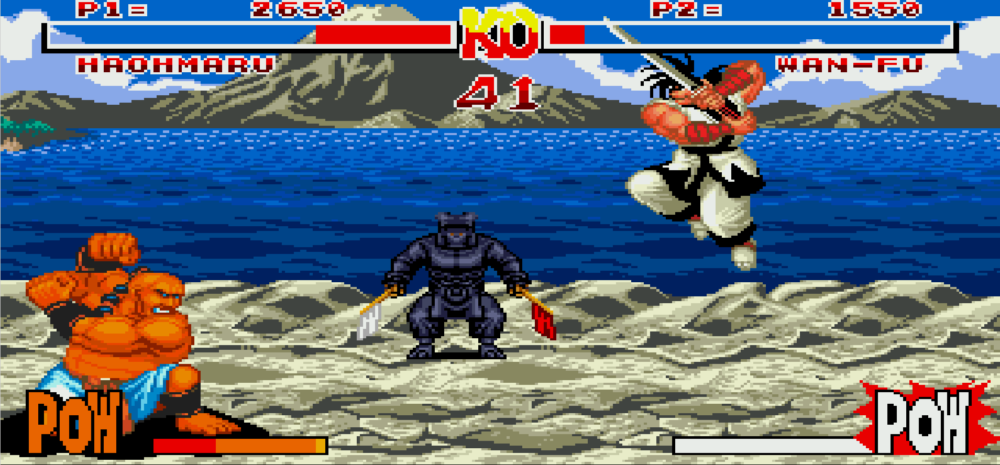
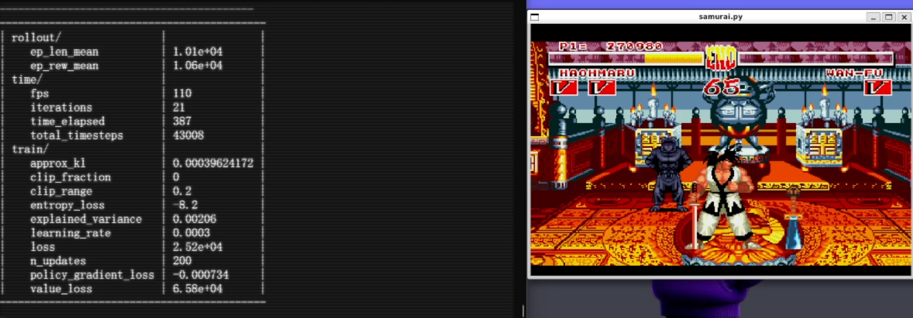
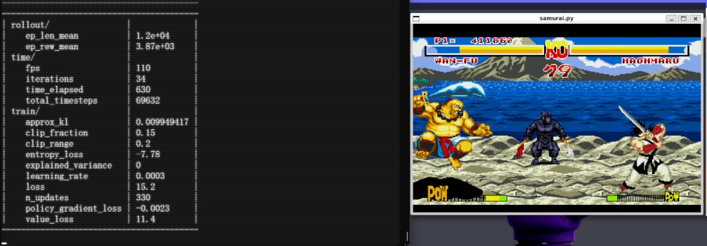
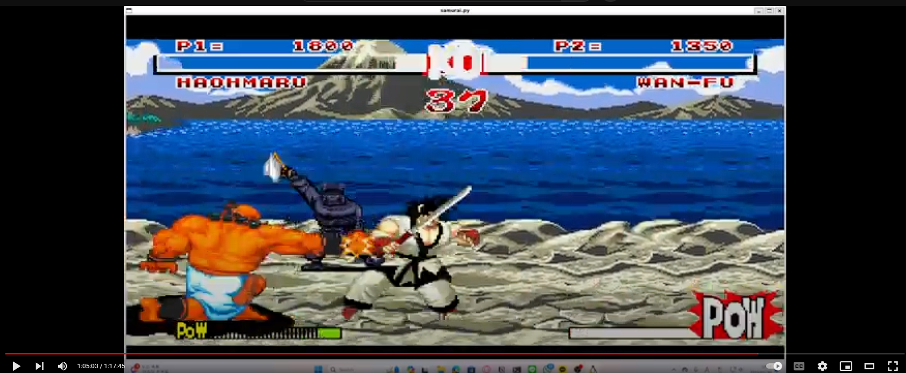

# Play Samurai Shodown Sega Genesis with PPO (Proximal Policy Optimization)

##### _P1 Agent versus P2 Agent_



##### Project Paper can be found here:
[https://drive.google.com/file/d/1BtXo0k9NrjHELJXyvvi_TslXu-WWfTDG/view?usp=sharing](https://stable-baselines3.readthedocs.io/en/master/)

Samurai Shodown, also known as Samurai Spirits (Japan) is a fighting game by SNK (株式会社SNK). Samurai Shodown is popular with its first release on Sega Genesis. Using the Sega Genesis Emulator, Reinforcement Learning agents can be trained to play retro games. With the policy gradient method, it can alternate between sampling data through interaction with the environment and optimizing a “surrogate” objective function using stochastic gradient ascent.

With this method, reinforcement learning can be implemented in playing retro games such as atari games, whereas this project is to train the agents to play Samurai Shodown. In this project, agents will be programmed to fight one another in one environment. The first agent will be Haohmaru and the second agent will be WanFu.

To train the first agent, the agent will be trained in a different state while training with a computer character. The opponent will be WanFu. To train the second agent, the agent will be trained by fighting a computer character of Haohmaru. These fighting scenarios depict a picture of fighting training before the agent against the agent.

##### _Training of P1 Agent versus Computer_



##### _Training of P2 Agent versus Computer_



After training to 200.000 timesteps or 98 iterations, the two agents will be put into the same environment. By this project, we can know that reinforcement learning can be implemented in retro fighting games.

## Result

[](https://youtu.be/7QozDvhn13o "Samurai Shodown Sega Genesis with Reinforcement Learning: PPO")

## Installation

This project is running in the Anaconda environment in Linux Ubuntu 22.04 with WSL2.  Ubuntu environment also can run this project with the same dependencies as in requirements. 

### Stable Baselines3

``` shell
pip3 install stable_baselines3[extra]
```

### Gym

``` shell
pip install gym==0.21.0
```

### gym-retro

``` shell
pip install gymnasium==0.29.1
```

### pyglet
``` shell
pip install pyglet==1.5.11
```

### pygame
``` shell
pip install pygame==2.1.0
```

### setuptools
``` shell
pip install setuptools==65.5.0
```

### Adding rom to gym retro
``` shell
python3 -m retro.import
```
Make sure the format is correct and readable by gym retro

## Run Python
Go into the directory and run the python script by:
``` shell
cd rl_stable/stable-retro/retro/data/stable/SamuraiShodown-Genesis
python3 samurai.py
```
## Problem found and solved
When running this project in conda environment in Linux Ubuntu 22.04 with WSL2, it should be able to run display window. If come across a problem regarding display issue, use these commands:
``` shell
ImportError:
    Error occurred while running `from pyglet.gl import *`
    HINT: make sure you have OpenGL install. On Ubuntu, you can run 'apt-get install python-opengl'.
```
Make sure the display is 0 which can be change with this command:
``` shell
export DISPLAY=:0
```
Run this command to solve the OpenGL error:
``` shell
sudo apt install freeglut3-dev
xvfb-run -s "-screen 0 1400x900x24" python <your_script.py>
```
You could also encounter this error:
``` shell
libGL error: MESA-LOADER: failed to open swrast: /usr/lib/dri/swrast_dri.so: cannot open shared object file: No such file or directory (search paths /usr/lib/x86_64-linux-gnu/dri:\$${ORIGIN}/dri:/usr/lib/dri, suffix _dri)
libGL error: failed to load driver: swrast
```
Simply run this command to solve the issue:
``` shell
export LIBGL_DEBUG=verbose
```
If the error turns into this:
``` shell
libGL: MESA-LOADER: failed to open /usr/lib/x86_64-linux-gnu/dri/swrast_dri.so: /home/dev/.pyenv/versions/miniconda3-latest/envs/su/bin/../lib/libstdc++.so.6: version `GLIBCXX_3.4.30' not found (required by /lib/x86_64-linux-gnu/libLLVM-13.so.1)
```
Run this command before executing the python program:
``` shell
ln -s -f /usr/lib/x86_64-linux-gnu/libstdc++.so.6.0.30 $CONDA_PREFIX/lib/libstdc++.so.6
```

## References

<details><summary> <b>Expand</b> </summary>

**Stable Baseline 3**
* [https://stable-baselines3.readthedocs.io/en/master/](https://stable-baselines3.readthedocs.io/en/master/)

**PPO (Proximal Policy Optimization)**
* [https://stable-baselines3.readthedocs.io/en/master/](https://stable-baselines3.readthedocs.io/en/master/)

**Gym**
* [https://www.gymlibrary.dev/index.html](https://www.gymlibrary.dev/index.html)

**Stable retro**
* [https://github.com/Farama-Foundation/stable-retro](https://github.com/Farama-Foundation/stable-retro)
